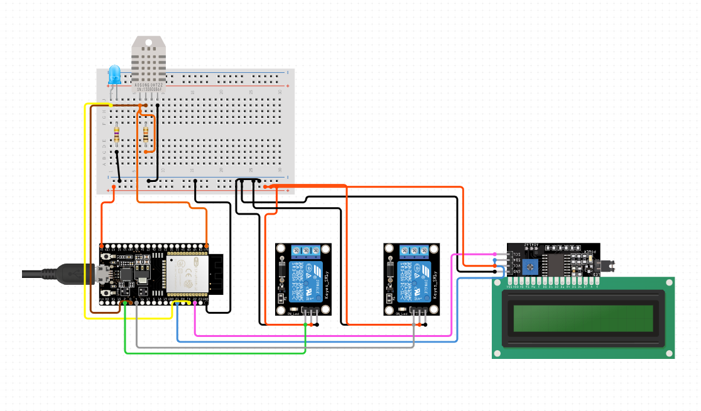

**Onderdelen**
| Component | Rol | Samenwerking |
| - | - | - |
| Adafruit Feather V2 | Hoofd computing unit waar alle tasks op draaien | Zorgt ervoor dat alle componenten met elkaar kunnen werken |
| LCD 16x2 | Visuele weergave van data | Zorgt ervoor dat de gelezen data van de DHT11 visueel wordt gemaakt |
| DHT11 | Meten van luchtvochtigheid en temperatuur | Dit werkt samen met de relay om apparaten aan en uit te zetten |
| Relay | Schakelen van 240V apparaten | Dit werkt met de DHT11 om de lamp en ventilator aan of uit te zetten aan de hand van temperatuur en luchtvochtigheid |

**Libraries**

Er zijn een paar libraries die gedownload moeten worden voor dit project.
1. *DHT sensor library* by Adafruit \
   Deze is nodig om de DHT11 sensor uit te lezen.
3. *LiquidCrystal I2C* by Frank de Brabander \
   Deze is nodig om tekst weer te kunnen geven op het LCD schermpje aan de hand van I2C data overdrachten

Hieronder is een visuele weergave van het schakelschema en hoe alles aan te sluiten:

